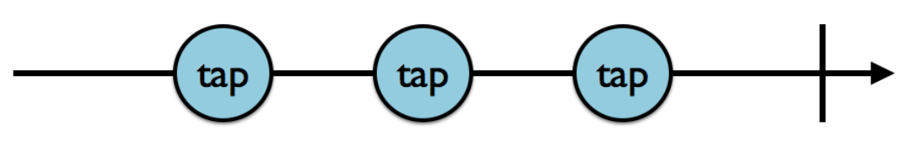
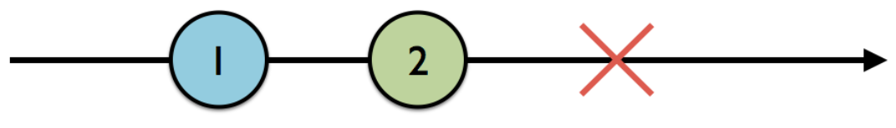

# Chapter 2: Observables

## 1. what is an observable?
 : 이벤트 시퀀스를 비동기적으로 생성하는 기능. 이 때 Observable이 지속적으로 이벤트를 발생시키는 것을 emit라고 한다.

### Lifecycle Of an observable
이벤트 | 특징 
---|:---:
`next ` | 다음(최신) 값을 전송하는 이벤트
`error ` | Observable이 값을 배출하다 에러 방출 시,  ``error`` 를 emit 후 종료하는 이벤트
`complete ` | 성공적으로 이벤트 시퀀스를 종료시키는 이벤트. 더이상 값을 emit 하지 않는다.

 
### 1. Observable의 LifeCycle (생명주기)

1) 세번의 `tap` 이벤트를 emit후, `complete` 를 통해 종료되는 Observable

2) 1,2 를 방출 후 에러가 발생하여 `error`를 통해 종료된 Observable

 

###2. Creating observables (생성)

~~~
let observable: Observable<Int> = Observable<Int>.just(one)  // 1

let observable2 = Observable.of(one, two, three) // 2

let observable3 = Observable.of([one, two, three]) // 3

let observable4 = Observable.from([one, two, three]) // 4
~~~

1. `just`: 오직 하나의 요소를 포함하는 Observable Sequence를 생성 

2. `of`: 주어진 값들에서 Observable Sequence를 생성
3. `of`: of의 인자로 array를 넣게 되면 [1,2,3]을 단일요소로 갖게 된다.   여기서 observable3의 타입은 **Observable<[Int]>**
4. 'from': arrary의 요소들로 Observable Sequence 생성
  observable4의 타입은  **Observable<[Int]>**

 

###3. Subscribing to observables (구독)
+  **Observable**은 **Sequence**의 정의일 뿐 **Subscribe**가 되기 전까지는 아무런 이벤트도 보내지 않는다. 

~~~
let observable = Observable.of(1, 2, 3)
     observable.subscribe({ (event) in
    	 print(event)
 	})
~~~

+ `.subscribe`는 escaping 클로저로 Event<Int>를 갖는다. escaping에 대한 리턴값은 없으며 `Disposable`을 리턴한다. 

 

###4. Disposing and terminating (메모리 해제)

+ `Disposable`는 Observable의 사용이 끝나면 메모리를 해제할 때 사용하는 인스턴스이다. 

+ RxSwift에서는 `DisposeBag` 을 사용하는데 DisposeBag instance의 deinit()이 실행될 때 모든 메모리를 해제시켜준다.    **DisposeBag  사용방법**은 DisposeBag에 subscribe가 리턴하는 Disposable 인스턴스를 넣어주기만 하면 된다. 

~~~
var disposeBag = DisposeBag()

let stringSequence = Observable.just("RxSwift Observable")

let subscription = stringSequence.subscribe { (event) in
  print(event)
}

// subscription 을 disposeBag에 넣어 메모리를 해제합니다.
subscription.disposed(by: disposeBag)

// 빠르게 비워주고 싶을때는 disposeBag을 새로 만들면 됩니다.
disposeBag = DisposeBag()
~~~

